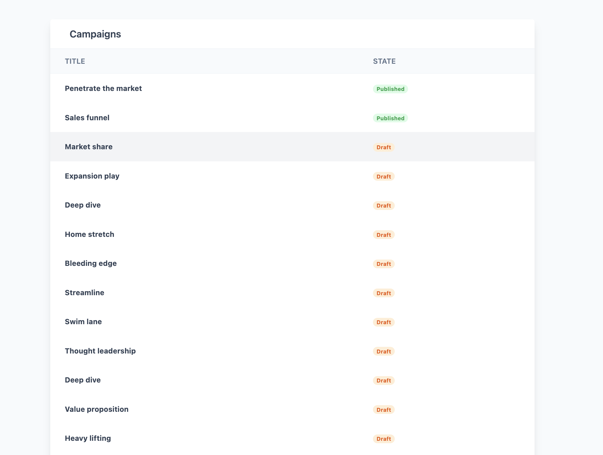
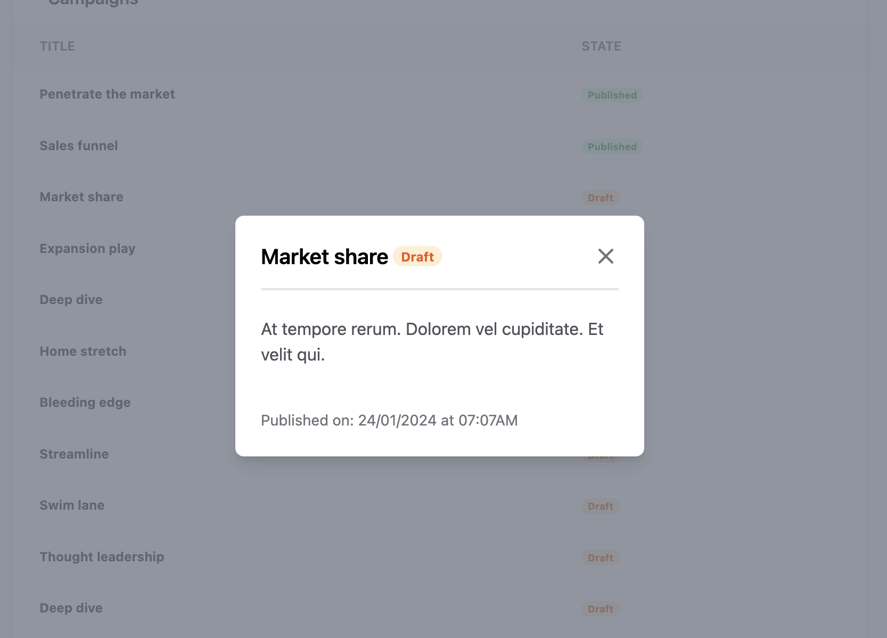

## gocertify Campaigns App

This is a Rails app with Turbowire, Stimulus.js and Tailwind CSS.
The goal is to display the campaigns of the app following an specific set of requirements.

*Create a Rails App, using esbuild and Tailwind*
*Create a Campaign model with title, description, state, publication_date and position attributes*
*Create controller, routes and views to display campaigns*
*Display campaigns in a table with two columns: title, state*
*Order campaigns by state (published, draft, archived) and position (from the latest to the first published)*
*Open an specific campaign in a pop-up, achieve that using stimulus and turbowire*
*Apply tailwind style*
*Apply Tests*

[Lorenna Vieira](mailto:lorennasv@gmail.com)

## Proposed Solution

- Created a Rails app with esbuild and added Tailwind gem
- Added models and validations to guarantee proper data
- Added scopes to improve queries from controllers
- Added controllers, routes and views to display the campaigns
- Added index using Tailwind Table template to display the campaigns
- Added a helper to display the correct color for the state, using a badge style
- Added a helper to format the date
- Added to the model humanized methods to humanize the state and position and keep the code DRY
- Added a modal stimulus controller to remove the hidden class from the modal
- Added turbo-frames to encapisulate the modal in the index view

### [Click here to see Demo]([https://www.loom.com/share/8aab3b3a21a74f07ae382632492e313a?sid=0c61018b-5182-4e0e-868f-f3a6215c22c1])

## Screenshots

## Assumptions

* Campaigns attributes are required by default

## Libraries / Tools Used

- Rails
- Stimulus.js
- Turbowire
- Tailwind CSS
- esbuild
- Rspec
- Capybara
- Factory Bot
- Faker
- Rubocop

## Setup

To configure the project:
`rails db:setup`

To install the dependencies:

`rails bundle install`

And to run the app:

`.bin/dev`

## Running the tests

You can run the unit tests using:

`rspec`

## Future Work

1. Improve tests
2. Add Jest to test the Stimulus controllers 
3. Improve styling, add a loading state for slow connections 
4. Add Decorator design Pattern and move the #humanized methods from the model to the decorator 
5. Add a search bar to filter the campaigns by title 
6. Add filters to order the campaigns by state and position 
7. Improve the show when accessed through the url, show the index behind 
8. Deploy the app
